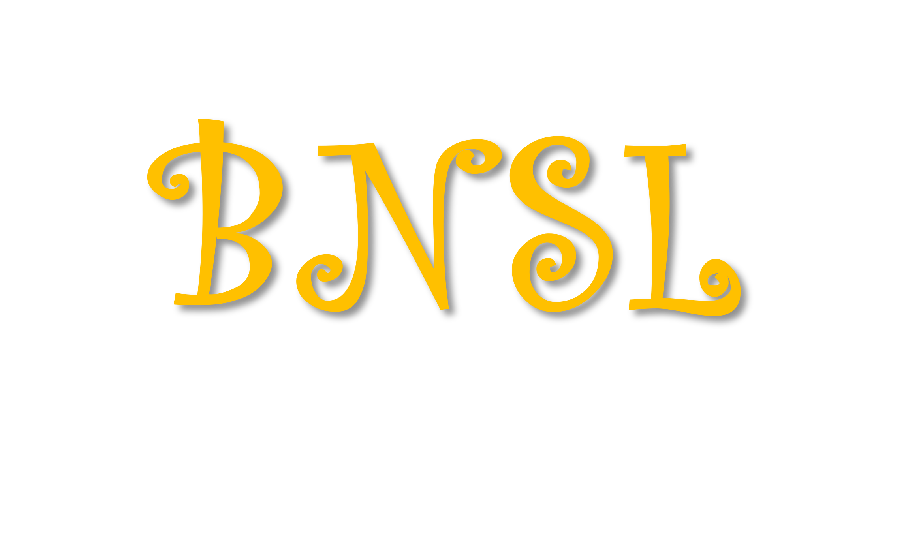

# Bayesian Network Structure Learning 

 

## Here you can use:
* Greedy hill climb
* Simulated Annealing
* Dynamic program: shortest path perspective
* PC algorithm
* Genetic algorithm 
* K2 algorithm 

## How to use:
Please check [document](https://howardhuang98.github.io/BNSL/).

## Acknowledgement
Any question, feel free to email me!  
Author: Huang Hao    
School: Tianjin University, Priceless Lab  

