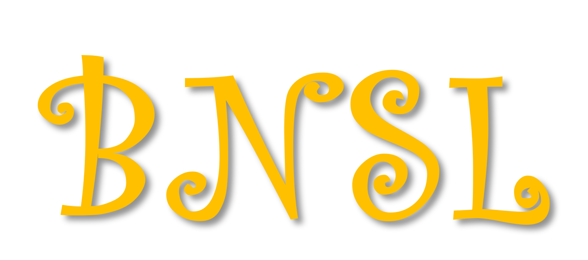

# Bayesian Network Structure Learning 

BNSL is a python library aiming help data scientists and researchers infer Bayesian Network structure from observed data.

## Here you can use:
* Greedy hill climb
* Simulated Annealing
* Dynamic planning: shortest path perspective
* PC algorithm
* Genetic algorithm 
* K2 algorithm 

## How to use: 
Please check [document](https://howardhuang98.github.io/BNSL/). You can also get a  basic introduction of BN. 

## Acknowledgement
Any question, feel free to email me!  
Author: Huang Hao    
E-mail: huanghao19980518@gmail.com  
Location: Tianjin University, Priceless Lab  

