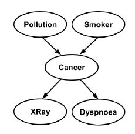
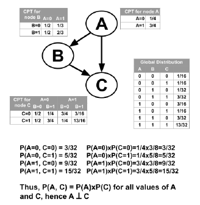
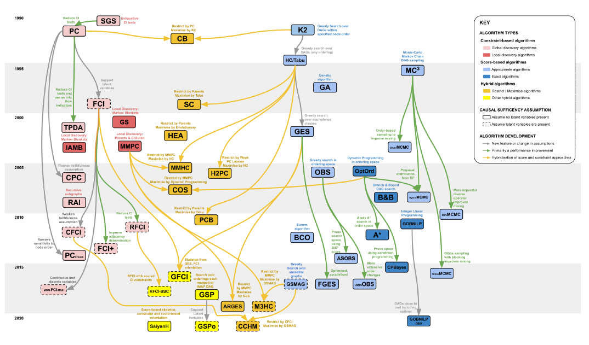

Bayesian network
==================

What can BN solve?
-------------------

Bayesian network(BN) is a type of a probabilistic graphical model for reasoning under uncertainty in fields as diverse as medicine, biology, epidemiology, economics and social sciences. 

Specifically, BN is used to answer the queries such as "what will be the likely effect of this intervention?" or "what factors are relevant to this effect?". 

BN model
------------
A bayesian network is defined with a tuple consisting of a Directed Acyclic Graph(DAG) *G*, and a set of parameters *θ*.

.. math::

	B = (G,\theta)

The DAG, *G* consists a set of nodes and directed edges, and subjects the constraint of acyclic.

.. math::
	
	G=(\boldsymbol{X}, \boldsymbol{E}) 

Let's take a look of a DAG example. 

	
In the DAG on Cancer, the 'Pollution' and 'Smoker' are the parents of 'Cancer', they are also known as the directed causes of 'Cancer'. This directed edges encoding the relationships of *dependency* and *independency*, for example, 'Pollution' and 'Smoker' are independent, 'Smoker' and 'Cancer' are dependent. 

The parameter set *θ* denotes the conditional probabilities based on these dependencies and independencies, e.g.,

.. math::
	
	P(X R a y \mid \text { Cancer, Smoker })=P(X R a y \mid \text { Cancer })

The probability distribution can be discrete or continuous. If the distribution is discrete, it is often denoted as a tabular probability.

Inferring the DAG, *G* and the parameters set, *θ* are the two major problems in Bayesian network. The parameters set is determined after knowing DAG, thus our library focuses on Bayesian network structure learning.  

Bayesian network structure learning
-----------------------------------

Learning the structure of BN is an NP-hard problem, Robinson(1973) showed that the recurrence relation:

.. math::

	\left|G_{n}\right|=\sum_{i=1}^{n}(-1)^{i-1}\left(\begin{array}{l}
	n \\
	i
	\end{array}\right) 2^{i(n-i)}\left|G_{n-i}\right|

It is the number of possible DAGs for *n* variables. If we have 8 variables, the number of possible DAGs will be 7.8e11, which is growing super-exponentially with the number of variables. 

To learn the DAG from observed data, there are plentiful research papers. Kitson(2021) reviewed the Bayesian network structure learning algorithms comprehensively.

.. seealso:: Kitson, N. K., Constantinou, A. C., Guo, Z., Liu, Y., & Chobtham, K. (2021). A survey of Bayesian Network structure learning. 

There are three types of structure learning algorithm:

* Contraint-based algorithm  

* Score-based algorithm  

* Hybrid algorithm

Constraint-based methods that eliminate and orientate edges based on a series of conditional independence tests (CI tests). Score-based methods, represent a traditional machine learning approach where the aim is to search over different graphs maximising an objective function. Hybrid algorithms that combine score-based and constraint-based
approaches.

Kitson showed a roadmap of the algorithms' development: 

We selected some representative algorithms to reproduce, and packaged them into estimator, so you can begin structure learning simply and quickly. Please check :ref:`available-estimators`.

Recommendation books and literatures
------------------------------------
《贝叶斯斯网引论》

